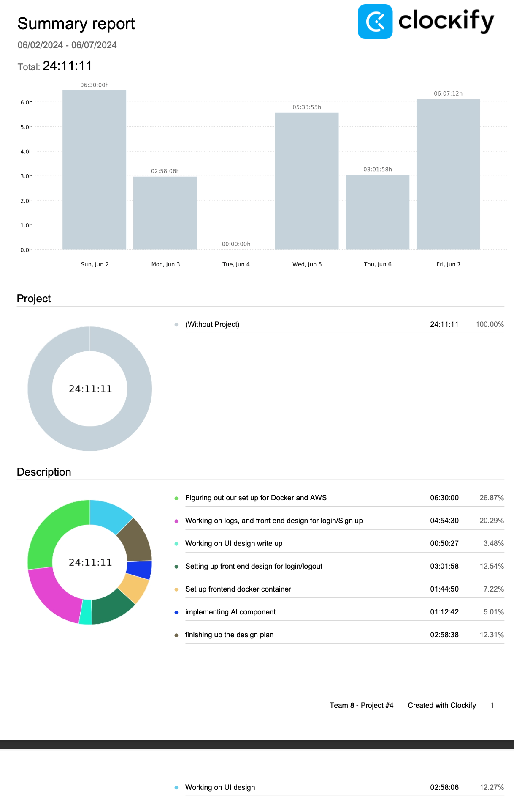
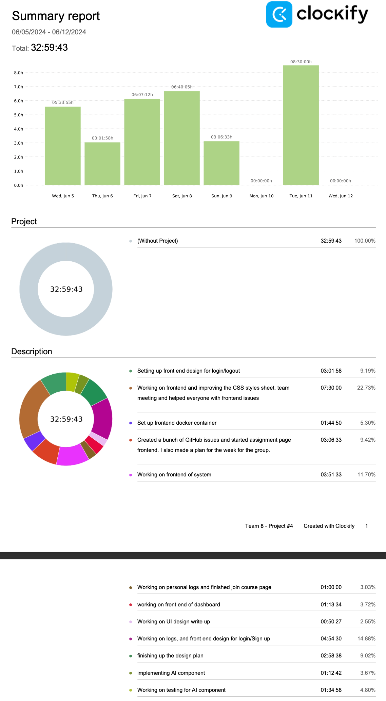

# Colton Palfrey - Project Contribution Time Log
-----------------------------------------------------------------------------------
## Cycle 1 and 2: Wednesday May 29th - Tuesday June 4th

### Timesheet
Clockify report

### Current Tasks
  * #1: Set up reverse proxy with server: I am setting up http proxy middle ware to route between prof pages, student pages, and admin pages
  * #2: Make forgot password email redirect page so that when a users receives an email to reset their password they can be redirected to this page.
  * #3: Set up backend for login/logout: I am setting up the SQL queries to work with our database to allow our login in to work properly with passport.js and to allow our signup page to actually add users to the database.

### Progress Update
<table>
    <tr>
        <td><strong>TASK/ISSUE #</strong>
        </td>
        <td><strong>STATUS</strong>
        </td>
    </tr>
    <tr>
        <td>Do UI design
        </td>
        <!-- Status -->
        <td>Complete
        </td>
    </tr>
    <tr>
        <td>Make design plan video
        </td>
        <!-- Status -->
        <td>Complete
        </td>
    </tr>
    <tr>
        <td>Set up AWS
        </td>
        <!-- Status -->
        <td>Complete
        </td>
    </tr>
  <tr>
        <td>Containerize frontend
        </td>
        <!-- Status -->
        <td>Complete
        </td>
    </tr>
</table>

### Cycle Goal Review (Reflection: what went well, what was done, what didn't; Retrospective: how is the process going and why?)
This week I spent alot of time working on learning docker and trying to figure out a hosting service to use. I got our frontend containerized but ran into some issues when it came to setting up node on my computer. I ended up figure out what was the issue (which was I had an old version of node installed) and fixing it.

### Next Cycle Goals (What are you going to accomplish during the next cycle)
- Make frontend general styling sheet
- Start making frontend for login/logout page
- Host pages on server and test them with docker-compose

# daily work break down for this cycle
## Wednesday May 29th
### 2 hours
- Researched how to use AWS for hosting
- Finished up the design document

## Thursday May 30th
### 2 hours
- Research File storage system (Amazon S3)
- Created Relationship Entity Diagram to plan Database
- Started Prototype Design

## Friday May 31st
### 2 hours
- Worked on prototype design
- worked on Relationship Entity Diagram

## Sunday June 2nd
### 6.5 hours
- Set up file structure
- Worked on setting up AWS
- Learned how to dockerize our project for development stage

## Monday June 3rd
### 3 hours
- Finished UI design
- Did code review and tested React app implementation from VEST

-----------------------------------------------------------------------------------
## Cycle 3: Wednesday June 5th - Tuesday June 11th

### Timesheet
Clockify report

### Current Tasks
  * #1: Set up reverse proxy with server: I am setting up http proxy middle ware to route between prof pages, student pages, and admin pages
  * #2: Make forgot password email redirect page so that when a users receives an email to reset their password they can be redirected to this page.
  * #3: Set up backend for login/logout: I am setting up the SQL queries to work with our database to allow our login in to work properly with passport.js and to allow our signup page to actually add users to the database.

### Progress Update (since June 4th 2024) 
<table>
    <tr>
        <td><strong>TASK/ISSUE #</strong>
        </td>
        <td><strong>STATUS</strong>
        </td>
    </tr>
    <tr>
        <td>Make Signin page
        </td>
        <!-- Status -->
        <td>Complete
        </td>
    </tr>
    <tr>
        <td>Make signup page
        </td>
        <!-- Status -->
        <td>Complete
        </td>
    </tr>
    <tr>
        <td>Make prof and student dashboard
        </td>
        <!-- Status -->
        <td>Complete
        </td>
    </tr>
  <tr>
        <td>Make account page
        </td>
        <!-- Status -->
        <td>Complete
        </td>
    </tr>
  <tr>
        <td>Make forgot password page
        </td>
        <!-- Status -->
        <td>Complete
        </td>
    </tr>
  <tr>
        <td>Make forgot password email redirect page
        </td>
        <!-- Status -->
        <td>In progress
        </td>
    </tr>
  <tr>
        <td>Make join course page
        </td>
        <!-- Status -->
        <td>Complete
        </td>
    </tr>
  <tr>
        <td>Dockerize/containerize llama3 using olama
        </td>
        <!-- Status -->
        <td>Complete
        </td>
    </tr>
  <tr>
        <td>Set up reverse proxy with server
        </td>
        <!-- Status -->
        <td>In progress
        </td>
    </tr>
  <tr>
        <td>Set up backend for login/logout
        </td>
        <!-- Status -->
        <td>In progress
        </td>
    </tr>
  <tr>
        <td>Finalize general styling sheet
        </td>
        <!-- Status -->
        <td>Complete
        </td>
    </tr>
</table>

### Cycle Goal Review (Reflection: what went well, what was done, what didn't; Retrospective: how is the process going and why?)
Everything has gone really well for me this week and I feel asthough I have been making some steady progress. This week I focused mostly on frontend and designed the login, logout, forgot password, dashboard, account and join class pages, as well and build mutiple reusable frontend modules such as an incourse menu and our websites nav bar. I also put a lot of time and thought into setting up a General styling sheet that is shared among all pages that lets us change the colours of the entire site just by changing three variables.

### Next Cycle Goals (What are you going to accomplish during the next cycle)
- SQL/backend implementation for login/Sign and well as joining and creating courses.
- Server side validation
- Writign lots of tests using jest for backend implementation
- Setting up express.js for managing server and routing state memory

# daily work break down for this cycle
## Wednesday June 5th
### 5.5 hours
- Added to the deisgn plan document.
- Set up and containerized frontend with Docker

## Thursday June 6th
### 3 hours
- Working on Login/logout page front end design

## Friday June 7th
### 6 hours
- Worked on Login/logout page front end design
- Worked on trying to help solve merge conflicts to merge branch with dockerized backend and merge branch with dockerized passport for authentication
- Work on ollama AI implementation and dockerization

## Saturday June 8th
## 6.75 hours
- Worked on learning and understand the flow and interaction of react and how it worked with javascrip with our system.
- Fixed the issue with our signup page and improved the look of the front end.
- Build our dashboard front end and fixed issue with drop down menu.
- Added page interactions and logout implementation.
- Finished dockerization of ollama in docker-compose.yml with llama3 implementation.
- Attempted to write tests using jest for ollama.
- Added tailwind css implementation.
- Worked building a generalized css template called "styles.css" for the front end.
- Lokking into using github CI/CD for testing when doing a PR and did some research on DRONECI.

## Sunday June 9th
## 3 hours
- Created Git issues for the team.
- Planned the teams sprint plan fo the week.
- Started working on the front end of the students assignments page.
- Seperated the front end into more modular components.

## Tuesday June 10th
## 8 hours
- Finalized the general styling sheet
- Make forgot password sign in
- Fixed nav bar component problem
- Created side menu component for our frontend
- Made account page
- Made join course page
- Team meeting and helped team with frontend setup

- -----------------------------------------------------------------------------------
## Cycle 5: Wednesday June 12th - Friday June 14th

### Current Tasks
  * #1: Make login and signup page work with backend
  * #2: Worked on mini presentation.

### Progress Update (since June 14th 2024) 
<table>
    <tr>
        <td><strong>TASK/ISSUE #</strong>
        </td>
        <td><strong>STATUS</strong>
        </td>
    </tr>
    <tr>
        <td> Login feature
        </td>
        <!-- Status -->
        <td> Complete
        </td>
    </tr>
    <tr>
        <td> Signup page
        </td>
        <!-- Status -->
        <td> Complete
        </td>
    </tr>
    <tr>
        <td> Mini presentation
        </td>
        <!-- Status -->
        <td> Complete
        </td>
    </tr>
 
</table>

### Cycle Goal Review (Reflection: what went well, what was done, what didn't; Retrospective: how is the process going and why?)
This cycle I had a very diffult time implementing the login and logout page. Chinmay, Jerry and I ended up workign togherther on this to try and figure out why things wourld woirk and spent about 7 hours each on this issue. Reflecting on it now I am very happy I reached out to my team members for help casue the 3 of us working toghether on this issue is what make the outcome a success.

### Next Cycle Goals (What are you going to accomplish during the next cycle)
- Change reverse proxy to nginx
- Fix Dashboard page and dashboad cards
- Set up session memory for student login
- Set up session memory for prof/T.A. + admin login
- Implement clearing session memory for logout.
-----------------------------------------------------------------------------------
## Cycle 6: Friday June 14th - Tuesday June 19th

### Timesheet
Clockify report

### Current Tasks
  * #1: Change reverse proxy to nginx
  * #2: Fix Dashboard page and dashboad cards
  * #3: Set up session memory for student login
  * #4: Set up session memory for prof/T.A. + admin login
  * #5: Implement clearing session memory for logout.

### Progress Update (since June 14th 2024) 
<table>
    <tr>
        <td><strong>TASK/ISSUE #</strong>
        </td>
        <td><strong>STATUS</strong>
        </td>
    </tr>
    <tr>
        <td>Reverse proxy
        </td>
        <!-- Status -->
        <td>In Progress
        </td>
    </tr>
    <tr>
        <td>Fix Dashboard
        </td>
        <!-- Status -->
        <td>Complete
        </td>
    </tr>
    <tr>
        <td>Set up session memory for student login
        </td>
        <!-- Status -->
        <td>In Progress
        </td>
    </tr>
    <tr>
        <td>Set up session memory for prof/T.A. + admin login
        </td>
        <!-- Status -->
        <td>In Progress
        </td>
    </tr>
    <tr>
        <td>Set up Clear session memory for logout
        </td>
        <!-- Status -->
        <td>In Progress
        </td>
    </tr>
 
</table>

### Cycle Goal Review (Reflection: what went well, what was done, what didn't; Retrospective: how is the process going and why?)
This cycle I went oh improving the look and layout of our dashboard for both Prof and Student view. I also changed our reverse proxy to nginx and set up session mememory. I had some dificulty setting up the proxy as I was runnign into alot of dokcer problems but after researching and wathcing some youtube videos I found out what was wrong.

### Next Cycle Goals (What are you going to accomplish during the next cycle)
Next cycle I am going to have a little more focus on frontend design. Because I have alot more expirence in frontend compared to my team members I can make front end designs much faster and help up put more focus on backend. I will also be tryign to implement a file storage system.

-----------------------------------------------------------------------------------
## Cycle 7: Wednesday June 19th - Friday June 21st

### Timesheet
Clockify report

### Current Tasks
  * #1: 
  * #2: 
  * #3: 

### Progress Update (since June 14th 2024) 
<table>
    <tr>
        <td><strong>TASK/ISSUE #</strong>
        </td>
        <td><strong>STATUS</strong>
        </td>
    </tr>
    <tr>
        <td> --
        </td>
        <!-- Status -->
        <td> --
        </td>
    </tr>
    <tr>
        <td> --
        </td>
        <!-- Status -->
        <td> --
        </td>
    </tr>
    <tr>
        <td> --
        </td>
        <!-- Status -->
        <td> --
        </td>
    </tr>
 
</table>

### Cycle Goal Review (Reflection: what went well, what was done, what didn't; Retrospective: how is the process going and why?)

### Next Cycle Goals (What are you going to accomplish during the next cycle)

-----------------------------------------------------------------------------------
## Cycle 8: Friday June 21st - Wednesday June 21st

### Timesheet
Clockify report

### Current Tasks
  * #1: 
  * #2: 
  * #3: 

### Progress Update (since June 14th 2024) 
<table>
    <tr>
        <td><strong>TASK/ISSUE #</strong>
        </td>
        <td><strong>STATUS</strong>
        </td>
    </tr>
    <tr>
        <td> --
        </td>
        <!-- Status -->
        <td> --
        </td>
    </tr>
    <tr>
        <td> --
        </td>
        <!-- Status -->
        <td> --
        </td>
    </tr>
    <tr>
        <td> --
        </td>
        <!-- Status -->
        <td> --
        </td>
    </tr>
 
</table>

### Cycle Goal Review (Reflection: what went well, what was done, what didn't; Retrospective: how is the process going and why?)

### Next Cycle Goals (What are you going to accomplish during the next cycle)

-----------------------------------------------------------------------------------
## Cycle 9: Friday June 26th - Wednesday June 28th

### Timesheet
Clockify report

### Current Tasks
  * #1: 
  * #2: 
  * #3: 

### Progress Update (since June 14th 2024) 
<table>
    <tr>
        <td><strong>TASK/ISSUE #</strong>
        </td>
        <td><strong>STATUS</strong>
        </td>
    </tr>
    <tr>
        <td> --
        </td>
        <!-- Status -->
        <td> --
        </td>
    </tr>
    <tr>
        <td> --
        </td>
        <!-- Status -->
        <td> --
        </td>
    </tr>
    <tr>
        <td> --
        </td>
        <!-- Status -->
        <td> --
        </td>
    </tr>
 
</table>

### Cycle Goal Review (Reflection: what went well, what was done, what didn't; Retrospective: how is the process going and why?)

### Next Cycle Goals (What are you going to accomplish during the next cycle)

-----------------------------------------------------------------------------------
## Cycle 10: Friday June 28th - Wednesday July 3rd

### Timesheet
Clockify report

### Current Tasks
  * #1: 
  * #2: 
  * #3: 

### Progress Update (since June 14th 2024) 
<table>
    <tr>
        <td><strong>TASK/ISSUE #</strong>
        </td>
        <td><strong>STATUS</strong>
        </td>
    </tr>
    <tr>
        <td> --
        </td>
        <!-- Status -->
        <td> --
        </td>
    </tr>
    <tr>
        <td> --
        </td>
        <!-- Status -->
        <td> --
        </td>
    </tr>
    <tr>
        <td> --
        </td>
        <!-- Status -->
        <td> --
        </td>
    </tr>
 
</table>

### Cycle Goal Review (Reflection: what went well, what was done, what didn't; Retrospective: how is the process going and why?)

### Next Cycle Goals (What are you going to accomplish during the next cycle)
