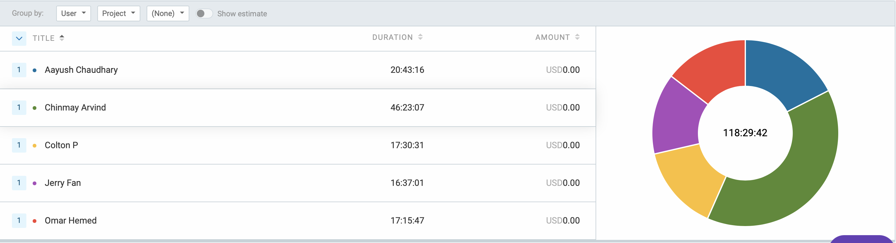

# Cycle 14 Weekly Log

- ## Date range: July 26 - July 31, 2024

 ### Which features were in the project plan cycle?
- AI set up with frontend
- Code review/manual testing: Fixing dozens of small backend and frontend mistakes.

- ### Which tasks from the project board are associated with these features?
- AI API implementation
- Create or edit an Assignment
- Edit AI grading for professor
- Assignment submissions
- Admin account management

### Which tasks are going to be targeted from the next cycle with time estimates and owners (ie planning and who is going to own/work on each task)
- Email Notifications
- Documentation

### Burn-up chart (velocity)

- Generated burn-up chart for the current cycle:
  

### Times for team/individual

- ### Table view of completed tasks on project board

<table border="1">
    <tr>
        <td><strong>TASK/ISSUE #</strong>
        </td>
    </tr>
    <tr>
        <td> Add link submission capability
        </td>
        <!-- Status -->
        <td> Colton
        </td>
    </tr>
    <tr>
        <td> Fixed due date on create assignment page
        </td>
        <!-- Status -->
        <td> Colton
        </td>
    </tr>
    <tr>
        <td> Fixed title of create assignment page
        </td>
        <!-- Status -->
        <td> Colton
        </td>
    </tr>
    <tr>
        <td> Fixed edit name and email boxes in eval editor for admin
        </td>
        <!-- Status -->
        <td> Colton
        </td>
    </tr>
    <tr>
        <td> Fixed and complete frontend and backend for Student grading page
        </td>
        <!-- Status -->
        <td> Colton
        </td>
    </tr>
    <tr>
        <td> Fixed create prompt and edit prompt modals
        </td>
        <!-- Status -->
        <td> Colton
        </td>
    </tr>
    <tr>
        <td> Fixed edit course modal
        </td>
        <!-- Status -->
        <td> Colton
        </td>
    </tr>
    <tr>
        <td> Fixed tool tips for student and people pages
        </td>
        <!-- Status -->
        <td> Colton
        </td>
    </tr>
    <tr>
        <td> Removed check image after joining a course
        </td>
        <!-- Status -->
        <td> Colton
        </td>
    </tr>
    <tr>
        <td> Fixed create course input text boxes
        </td>
        <!-- Status -->
        <td> Colton
        </td>
    </tr>
    <tr>
        <td> Fixed frontend display on AI-settings page
        </td>
        <!-- Status -->
        <td> Colton
        </td>
    </tr>
    <tr>
        <td> Changed the colour and styling of the entire site to make it more modern and feel like canvas.
        </td>
        <!-- Status -->
        <td> Colton
        </td>
    </tr>
    <tr>
        <td> Implementing AI into frontend
        </td>
        <!-- Status -->
        <td> Chinmay
        </td>
    </tr>
    <tr>
        <td> Implementing links with the AI model
        </td>
        <!-- Status -->
        <td> Chinmay
        </td>
    </tr>
    <tr>
        <td> Changed the text for the AI help page
        </td>
        <!-- Status -->
        <td> Aayush
        </td>
    </tr>
     <tr>
        <td> add course management frontend and backend - admin view
        </td>
        <!-- Status -->
        <td> Jerry
        </td>
    </tr>
    <tr>
        <td> Enable student deletion reversion - admin view
        </td>
        <!-- Status -->
        <td> Jerry
        </td>
    </tr>
     <tr>
        <td> enable evaluator deletion reversion - admin view
        </td>
        <!-- Status -->
        <td> Jerry
        </td>
    </tr>
     <tr>
        <td> enable course deletion reversion - admin view
        </td>
        <!-- Status -->
        <td> Jerry
        </td>
    </tr>
     <tr>
        <td> enable student course drop reversion - admin view
        </td>
        <!-- Status -->
        <td> Jerry
        </td>
    </tr>
     <tr>
        <td> enable evaluator course drop reversion - admin view
        </td>
        <!-- Status -->
        <td> Jerry
        </td>
    </tr>
</table>

- ### Table view of in progress tasks on project board
<table border="1">
<tr>
        <td><strong>TASK/ISSUE #</strong>
        </td>
    </tr>
    <tr>
        <td> Email notifications
        </td>
        <!-- Status -->
        <td> Colton
        </td>
    </tr>
    <tr>
        <td> Documentation
        </td>
        <!-- Status -->
        <td> Whole team
        </td>
    </tr>
</table>

- All backend tests are passing with 100% coverage. We are working on frontend tests using selenium.
