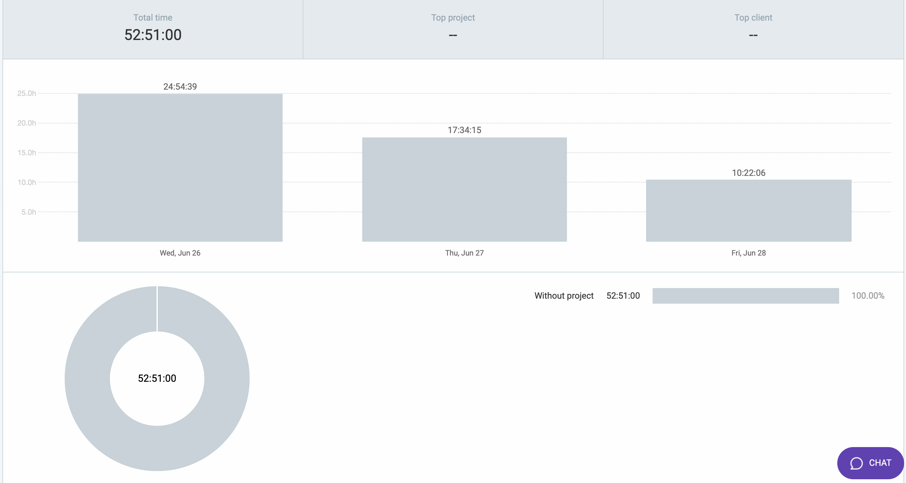

### Burn-up chart (velocity)

- Generated burn-up chart for the current cycle:
  

### Times for team

- ### Table view of completed tasks on project board

<table border="1">
    <tr>
        <td><strong>TASK/ISSUE #</strong>
        </td>
    </tr>
    <tr>
        <td> Set up session memory for prof/T.A. + admin
        </td>
    </tr>
    <tr>
        <td> Containerized admin backend and routed reverse proxy for backend calls
        </td>
    </tr>
    <tr>
        <td> Stored important user information about user types in the session when a user logs in so we know what to display to them
        </td>
    </tr>
    <tr>
        <td> Set up frontend and backend for admin sign in and account creation (with access key)
        </td>
    </tr>
    <tr>
        <td> Set up frontend and backend for evaluator signin
        </td>
    </tr>
    <tr>
        <td> Set up session storages and locked pages for both the evulator and Admin.
        </td>
    </tr>
    <tr>
        <td> Set up admin and evaluator session logout 
        </td>
    </tr>
    <tr>
        <td> set up admin and evaluator side menu bar and proper page navigation
        </td>
    </tr>
    <tr>
        <td> Set up the proper display and storage of site images in the reverse proxy frontend container.
        </td>
    </tr>
    <tr>
        <td> Forgot and reset password
        </td>
    </tr>
  <tr>
        <td> Implementing Review feedback for frontend for Student manager select student admin portal
        </td>
    </tr>
    <tr>
        <td> Create assignment page - PROF VIEW ONLY (frontend)
        </td>
    </tr>
  <tr>
        <td> Create assignment page - PROF VIEW ONLY (backend)
        </td>
    </tr>
  <tr>
        <td> Implementing review feedback for frontend for Create assignment page - PROF VIEW ONLY
        </td>
    </tr>
  <tr>
        <td> Implement a feature that allows instructors to update course details
        </td>
    </tr>
  <tr>
        <td> Implement a feature that allows instructors to delete courses
        </td>
    </tr>
  <tr>
        <td> Implement a feature that allows instructors to delete and add TA to a course
        </td>
    </tr>
</table>

- ### Table view of in progress tasks on project board
<table border="1">
<tr>
        <td><strong>TASK/ISSUE #</strong>
        </td>
    </tr>
<tr>
        <td> CI-CD pipeline fix
        </td>
    </tr>
    <tr>
        <td> Node file storage
        </td>
    </tr>
    <tr>
        <td> Create an API endpoint for instructors to create new assignments
        </td>
    </tr>
    <tr>
        <td> Develop functionality for instructors to upload rubrics and answer keys for assignment
        </td>
    </tr>
  <tr>
        <td> Testing for account management
        </td>
    </tr>
  <tr>
</table>

### Which tasks are going to be targeted from the next cycle 
- Client side validation for change password
- Join a course backend
- Display people backend
- Grades backend and add dummy data for this into the database
- Assignments backend and add dummy data for this into the database
- Student submissions backend and add dummy data for this into the database
- Add name on nav bar when the student is logged in
- Change the course name in the nav bar to be dynamic like so <course number> - <course name> (this should show on the nav bar at all times whenever the user is navigation through any of the side menu bar tabs so that know which course they are looking through)
- Display all students from database in student manager
- Display all evaluators from database in evaluator manager
- Add account page and account page backend for admin
- Add help page for admin 
- Backend for a selected student in admin portal where you can see all their info form the database (ability to delete a evaluator, or drop them from a course)
- Change the course name in the nav bar to be dynamic like so <course number> - <course name> (this should show on the nav bar at all times whenever the user is navigation through any of the side menu bar tabs so that know which course they are looking through)
- Forgot password backend
- Redo frontend for eval manager
- FIX EVAL LOGIN!!!
- Add account page and account page backend for admin (use basically the same code as student account page)
- Add help page for admin (basically the same as student help page)
- Display students backend (same backend as people backend on student page)
- Assignments backend and add dummy data for this into the database
- Grades backend and add dummy data for this into the database (Should calculate averages from database data before displaying grades to user)
- Backend for displaying all of a profs rubrics and add dummy data for this into the database
- Backend for displaying all submissions of all assignments and add dummy data for this into the database
- Forgot password backend
- Add name on nav bar when the eval is logged in
- Edit rubric frontend
- Assignment submission page

### Project Progress
- Frontend: 95% complete
- Backend: 50% complete
